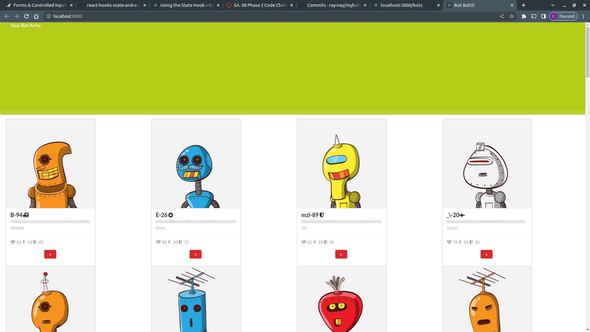
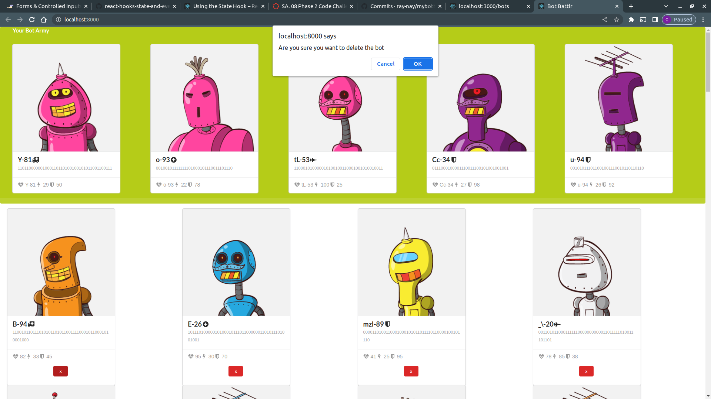
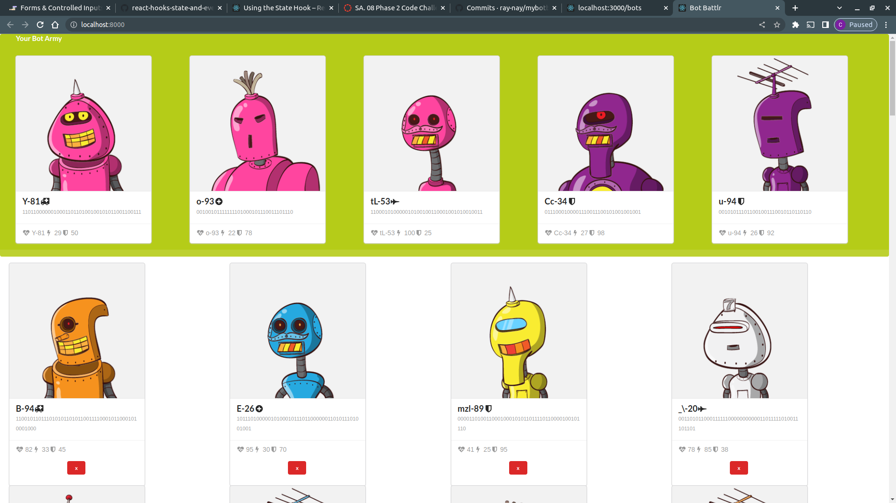

# Name of the Project
Bot Battlr
### Author : Name Date
Catherine Renee Mumbi 24/01/2022
## Project Description
This project is a website application that displays to the user a list of all the bots on the browser in form of cards.
The project incorporates a functionality that enables the user to add their favorite bots to the 'Your Bots Army collection.
This is achieved by clicking on the bot you would like to add.  
The user can also add or delete a bot by pressing on the (X) icon which will delete the bot permanently from the Bot collection as well as from the Your bot army section. 
This deletion will also persist to the database.

## Project SetUp 
 The project is set up in React files.

 The React files contains components that have the codes that will enable us to achieve the functionality of each program. 
 The Botcard component contains the function to delete the bots permanently.
 The Bot collection component stores the  function to fetch all the bots.
 YourBotsArmy component holds the favorite bots that the user would wish to add to their army.

******

## Technologies Used
1.React
2. CSS
3. JavaScript
4. URL: 'http://localhost:3000/bots'
*****

### Landing page 
This is the landing page.

### Deleting 
This is the what deleting a bot displays.

### Your favorite bots army page
This is the section that displays the bots selected as your favorites.

## LIve site
[Live link]("https://mybotbattlr.vercel.app/")

## Contact Information
* catherine.mumbi@student.moringaschool.com
*****